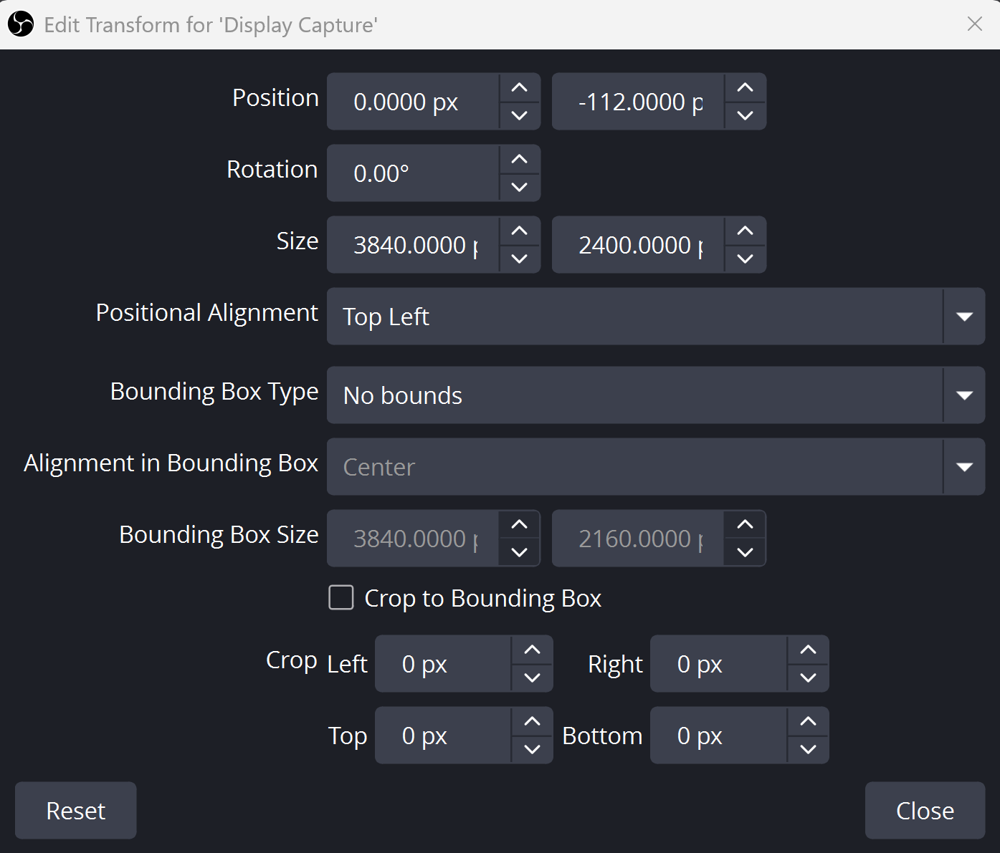

# Screen recording

## OBS

### Installation

**Windows:**
1. Download OBS Studio from [obsproject.com](https://obsproject.com)
2. Run the installer and follow the prompts
3. Launch OBS and complete the auto-configuration wizard

**Alternative (winget):**
```bash
winget install OBSProject.OBSStudio
```

### 4K Recording Setup with NVIDIA DSR

To record in 4K on a laptop display, use NVIDIA's Deep Learning Super Resolution.

#### Step 1: Enable NVIDIA DSR

1. Right-click desktop → **NVIDIA Control Panel**
2. Go to **Manage 3D settings** → **Global Settings**
3. Find **DSR - Factors**
4. Check **2.25x DL (3840 x 2400)**
   - "DL" = Deep Learning - uses AI-powered scaling with ~half the performance cost of legacy DSR
5. Click **OK**
6. Click **Apply** in the main window

#### Step 2: Configure OBS for 4K Output

1. Open OBS Studio
2. Go to **Settings** → **Video**
3. Configure the following:

| Setting | Value |
|---------|-------|
| Base (Canvas) Resolution | 3840x2160 (16:9 for YouTube) |
| Output (Scaled) Resolution | 3840x2160 (16:9 for YouTube) |
| Downscale Filter | Lanczos |
| FPS | 60 |

*NOTE: If the resolution 3840x2160 doesn't appear, just add it manually.*

4. Click **Apply** → **OK**

#### Step 3: Recording Settings (Recommended)

1. Go to **Settings** → **Output**
2. Set Output Mode to **Advanced**
3. Under **Recording** tab:
   - Encoder: NVIDIA NVENC H.264 (or HEVC for smaller files)
   - Rate Control: CQP
   - CQ Level: 18-20 (lower = better quality, larger files)

4. Click **Apply** → **OK**

### Create Three Scenes

In OBS, you'll create a scene for each recording mode:

#### Scene 1: Screen Only

- Click + under Scenes, name it "Screen Only"
- Add source → Display Capture (or Game Capture if recording games)
- The 16:9 Alignment (Precision Method):
    - Press Ctrl + E to open the Edit Transform window.
    - Set Bounding Box Type to No bounding box.
    - Set Size to 3840 x 2400.
    - Set Position Y to -112.0000 px. This hides the top browser tabs and aligns the stripe above your taskbar perfectly with the bottom of the frame.
- Your Rode mic will automatically be included from global settings.

<p align="center">
  
</p>

#### Scene 2: Camera Only

- Create new scene "Camera Only"
- Add source → Video Capture Device → select your webcam
- Resize to fill the canvas

#### Scene 3: Screen + Facecam (Picture-in-Picture)

- Create new scene "Screen + Facecam"
- Add source → Display Capture
- Add source → Video Capture Device (your webcam)
- Resize the webcam to a small box and drag it to the bottom corner